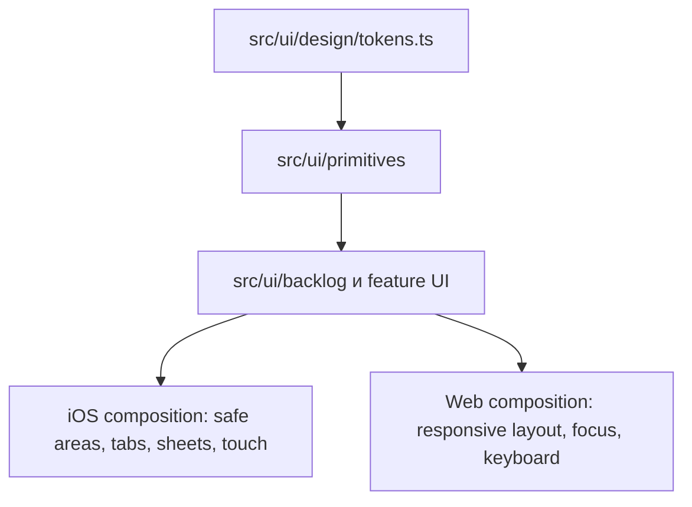

# Task Tracker — архитектура UI

**Статус:** утверждён вариант 2 — общие design tokens и контракты, разумно общие UI-компоненты, platform-specific композиция.

## Границы слоёв

1. `src/ui/design/tokens.ts` содержит неизменяемые semantic values и не зависит от React или платформы.
2. `src/ui/primitives/` содержит только повторяемые представления без доменных запросов и бизнес-решений.
3. `src/ui/<feature>/` собирает предметные компоненты из данных, переданных экраном/provider.
4. Маршруты `src/app/` отвечают за Expo Router navigation и не обращаются напрямую к SQLite.

## Что общее

- tokens, типы props и labels/semantic roles;
- простые карточки, кнопки, badges и list rows там, где взаимодействие одинаково;
- view-models и уже существующие App Services;
- domain/use-case границы и тесты поведения.

## Что platform-specific

Когда расположение или взаимодействие различаются, создаётся локальная реализация с единым контрактом: `component.native.tsx` и `component.web.tsx`.

| Область | iOS | Web |
| --- | --- | --- |
| Навигация | Нижние tabs с safe-area inset | Адаптивная навигационная композиция, не растянутая телефонная панель |
| Модальные поверхности | Native modal / bottom sheet, keyboard avoidance | Dialog / panel с focus management и Escape |
| Взаимодействие | Pressed, touch targets, прокрутка | Hover как дополнительный сигнал, focus-visible, tab order и pointer |
| Layout | Портретный экран, плотность iPhone | Responsive grid/columns после отдельного утверждения desktop-композиции |

`Platform.select` допустим только для малого style delta. Ветвление layout или DOM/interaction behaviour в одном компоненте не используется: в таком случае нужны два файла с общим contract.

## Нынешняя граница поставки

Данная поставка применяет tokens и общие primitives к четырём утверждённым экранам: «План B», Backlog 2, «Завершённые 1» и «Настройки 2». Их feature-композиции находятся в `src/ui/plan`, `src/ui/backlog`, `src/ui/completed` и `src/ui/settings`; маршруты остаются тонкими связками Expo Router. Demo-модели живут рядом с feature UI и не изменяют domain, SQLite-репозитории или контракты сервисов.

На wide web временно применяется центрированная мобильная композиция с token `size.temporaryWideWebContentMaxWidth`. Это не является финальной desktop-web архитектурой и не заменяет предусмотренную вариантом 2 отдельную responsive/platform-specific композицию. Её нужно согласовать отдельно, сохранив tokens и визуальный язык.
