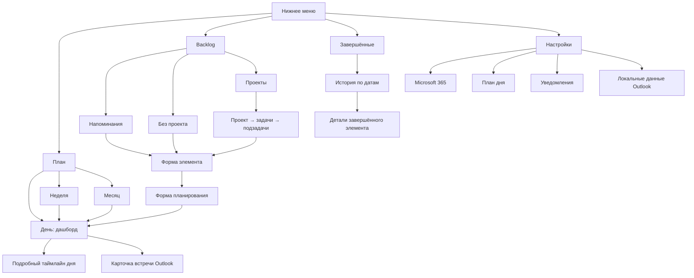
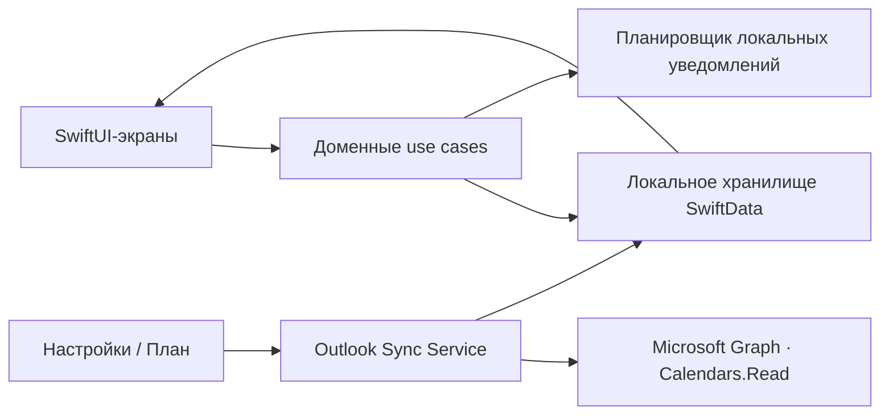

# Дизайн интерфейса MVP iOS-планировщика

Дата: 1 августа 2026 г.
Основание: `ТЗ_iOS_планировщик_MVP.docx`, версия 1.0 от 31 июля 2026 г.
Статус: визуальная структура согласована; документ подготовлен для финального просмотра перед планированием реализации.

## 1. Цель дизайна

Интерфейс должен давать пользователю один достоверный план дня, в котором совместно видны личные задачи, напоминания и встречи основного календаря Microsoft 365 Outlook. Основной пользовательский цикл: выбрать дело из Backlog, запланировать его, выполнить или перенести, при необходимости создать связанное напоминание об ожидаемом ответе.

Форма продукта: нативное приложение для iPhone, iOS 26.0+, вертикальная ориентация, русский язык. Нижняя навигация постоянна и содержит четыре вкладки: «План», `Backlog`, «Завершённые», «Настройки».

## 2. Согласованные направления

| Раздел | Выбранный вариант | Главный принцип |
|---|---|---|
| План | B — дашборд дня | Сначала состояние дня и ближайшее действие, затем дела без времени и расписание |
| Backlog | 2 — карточки-категории | Спокойный обзор трёх обязательных групп с переходом внутрь |
| Завершённые | 1 — история по датам | Архив сгруппирован по дате завершения |
| Настройки | 2 — панель состояния | Microsoft 365 и системные параметры представлены отдельными карточками |

Система использует нативную визуальную лексику iOS: системные шрифты, `NavigationStack`, карточки со скруглениями, системные меню и sheets, стандартные подтверждения опасных действий. Цвет не используется для различения проектов.

## 3. Информационная архитектура

## 4. Общая навигация

- Нижнее меню всегда содержит четыре пункта в одном порядке: «План», `Backlog`, «Завершённые», «Настройки».
- Смена вкладки сохраняет текущий контекст вкладки в пределах текущего запуска: выбранную дату плана, раскрытую категорию Backlog, период архива и позицию прокрутки настроек.
- Иерархические переходы используют стандартную кнопку «Назад».
- Создание и редактирование элемента выполняются в modal sheet. Опасные и необратимые действия выполняются только через системный confirmation dialog.
- Меню режима плана содержит ровно три пункта: «День», «Неделя», «Месяц».

## 5. Вкладка «План»

### 5.1. День — дашборд

Верхняя область содержит:

- дату и день недели;
- кнопку выбора вида «День / Неделя / Месяц»;
- кнопку ручной синхронизации Outlook;
- время последней успешной синхронизации;
- ненавязчивый статус ошибки синхронизации;
- процент выполнения дня;
- суммарное запланированное время и загрузку;
- сохранённую оценку энергии дня, если пользователь её ввёл.

Главная карточка показывает процент выполнения, плановые часы и ближайшее действие. Энергия отображается только как справочный показатель и не влияет на рекомендации или порядок дел.

Ниже расположены два блока:

1. «Без времени» — напоминания на дату, задачи с датой или периодом без фиксированного времени и встречи Outlook на весь день.
2. «Расписание» — компактный список ближайших временных элементов. Команда «Открыть день» раскрывает подробный таймлайн внутри вкладки «План»; режим по-прежнему считается режимом «День».

Кнопка `+` открывает выбор «Новая задача» или «Новое напоминание». Новая задача может быть сразу запланирована либо сохранена в Backlog. Создание проекта остаётся в Backlog.

### 5.2. Подробный таймлайн

- По умолчанию видим рабочий диапазон 08:00–22:00, но прокрутка доступна на все 24 часа.
- Задачи и подзадачи показываются зелёными блоками.
- Активные Outlook-встречи используют нейтральный сине-серый фон, чтобы не смешиваться с личными задачами.
- Отменённая встреча имеет серый фон, зачёркнутое название и пометку «Отменено».
- Текущая линия времени заметна, но не перекрывает текст.
- Пересекающиеся элементы располагаются рядом. Интерфейс не скрывает конфликт и не вычитает пересечение из расчёта загрузки.
- Drag-and-drop и изменение длительности жестом отсутствуют. Изменение выполняется через форму элемента.

Нажатие на личный элемент открывает форму просмотра и редактирования. Нажатие на Outlook-встречу открывает read-only карточку с организатором, участниками, местом, описанием и ссылкой на онлайн-встречу.

### 5.3. Неделя и месяц

- Неделя начинается с понедельника и показывает семь дней с датой, днём недели и точным процентом загрузки.
- Месяц представлен календарной сеткой; в ячейке видны число и точная загрузка.
- Цвет загрузки: 0–50% — зелёный, 51–70% — жёлтый, 71% и выше — красный.
- Значение не ограничивается 100%.
- Нажатие на дату переводит в режим «День» для выбранной даты.
- Смена недели или месяца выполняется свайпом и доступными стрелками навигации.

### 5.4. Первое открытие дня

При первом открытии приложения в календарный день поверх «Плана» появляется неблокирующий запрос энергии. Пользователь выбирает значение 0–100% с шагом 5%, вводит точное значение или пропускает. После ответа или пропуска запрос в этот день повторно не показывается.

## 6. Вкладка Backlog

### 6.1. Корневой экран

Экран содержит три карточки в обязательном порядке:

1. «Напоминания» — все напоминания без даты.
2. «Без проекта» — задачи без проекта и их подзадачи.
3. «Проекты» — пользовательские проекты, задачи и подзадачи.

Каждая карточка показывает количество элементов и до двух строк предпросмотра. Нажатие открывает соответствующий список. Поиска и фильтров на экране нет.

Кнопка `+` открывает выбор: «Новый проект», «Новая задача», «Новое напоминание». При создании задачи обязательным является только название. При создании напоминания обязательным является только название. Начальные категории и проекты автоматически не создаются.

### 6.2. Внутренние списки

- Список напоминаний содержит название и при наличии оценочную длительность.
- «Без проекта» содержит задачи и подзадачи без проекта.
- Экран проектов показывает проект, вложенные задачи и подзадачи. Четвёртый уровень отсутствует.
- Проект можно переименовать, отредактировать, наполнить задачами и завершить вручную.
- Завершение всех задач не завершает проект автоматически.
- Тап по задаче или подзадаче открывает форму элемента с основным действием «Запланировать».
- Тап по напоминанию открывает форму с командами «Назначить дату» и «Преобразовать в задачу».

### 6.3. Форма планирования

Значения по умолчанию:

- дата — сегодня по часовому поясу устройства;
- начало — текущее время, округлённое вверх до ближайших 5 минут;
- длительность — 60 минут.

Пользователь может выбрать день без конкретного времени, период, один или несколько временных блоков и правило повторения. При выборе точного времени для напоминания интерфейс сначала объясняет преобразование в задачу и просит выбрать проект либо «Без проекта».

Если новый блок пересекается с задачей или встречей, confirmation dialog перечисляет конфликты и предлагает «Отмена» или «Сохранить пересечение».

## 7. Вкладка «Завершённые»

Экран представляет собой историю, сгруппированную по датам завершения.

- В шапке находятся поиск по названию и фильтры «Сегодня», «Неделя», «Месяц», «Год».
- Строка архива показывает тип элемента, название, исходный проект и время завершения.
- В архив попадают проекты, задачи, подзадачи и напоминания.
- Outlook-встречи в архиве не показываются.
- Нажатие открывает read-only детали завершённого элемента.
- Меню строки содержит «Удалить окончательно».
- Удаление требует подтверждения; корзины и автоматической очистки нет.

## 8. Вкладка «Настройки»

Экран использует карточки состояния.

### 8.1. Microsoft 365

Карточка показывает состояние подключения, корпоративную учётную запись и время последней синхронизации. Доступны действия:

- подключить;
- повторно войти;
- отключить;
- обновить сейчас.

Управление учётной записью открывается в отдельном sheet. Отключение после подтверждения завершает авторизованную сессию и удаляет токены. Локальная копия Outlook-данных управляется отдельным действием ниже и не удаляется неявно.

### 8.2. План дня

- Рабочий диапазон: 08:00–22:00 по умолчанию.
- Время вечерней проверки: 21:00 по умолчанию.
- Оба значения редактируются через компактные системные time pickers.

### 8.3. Уведомления

- Карточка показывает состояние системного разрешения.
- Предварительное уведомление: 10 минут по умолчанию.
- При запрете показываются объяснение и ссылка на системные настройки iOS.
- Работа приложения не блокируется отсутствием разрешения.

### 8.4. Данные и служебная информация

- «Удалить локальные данные Outlook» — опасное действие с отдельным подтверждением; корпоративная учётная запись при этом остаётся подключённой.
- Отображается версия приложения.
- Часовой пояс всегда берётся с устройства; отдельного выбора часового пояса нет.
- На экране явно сообщается, что без iCloud локальные задачи будут потеряны при удалении приложения.

## 9. Ключевые пользовательские пути

### 9.1. Запланировать задачу из Backlog

1. Пользователь открывает Backlog.
2. Выбирает карточку категории.
3. Открывает задачу.
4. Нажимает «Запланировать».
5. Проверяет дату, время и длительность.
6. При конфликте отменяет действие или сохраняет пересечение.
7. После сохранения приложение открывает выбранный день в «Плане» и визуально выделяет добавленный элемент.

### 9.2. Завершить временную задачу

1. После окончания последнего блока появляется вопрос «Удалось закончить задачу?».
2. При ответе «Да» задача переходит в «Завершённые».
3. Затем предлагается флаг «Требуется ответ».
4. Если ответ требуется, создаётся связанное напоминание на 3, 7, 14 дней или выбранную дату.
5. При ответе «Нет» пользователь выбирает: продолжить сейчас, запланировать на другую дату или вернуть в Backlog.
6. Причина переноса предлагается, но не является обязательной.

### 9.3. Проверить ожидаемый ответ

1. В дату связанного напоминания приложение спрашивает «Ответ получен?».
2. При ответе «Да» пользователь закрывает напоминание или закрывает его и открывает пустую форму новой задачи.
3. При ответе «Нет» выбирается новая проверка через 3, 7, 14 дней или в произвольную дату.

### 9.4. Обработать Outlook-встречу

1. Пользователь подключает Microsoft 365 в «Настройках».
2. После синхронизации встреча появляется в «Плане».
3. Нажатие открывает read-only карточку и ссылку на Teams или другую онлайн-встречу.
4. После окончания приложение спрашивает «Встреча состоялась?».
5. При ответе «Да» можно открыть пустую форму новой задачи или закрыть диалог.
6. При ответе «Нет» дополнительных действий нет.

### 9.5. Вечерняя проверка

В установленное время приложение последовательно показывает незавершённые задачи и напоминания без фиксированного времени. Для каждого элемента доступны завершение, перенос на завтра, выбор другой даты и, только для задачи, возврат в Backlog. При отсутствии ответа до конца дня элемент автоматически переносится по правилам ТЗ.

## 10. Переиспользуемые компоненты

- `RootTabBar` — четыре постоянные вкладки.
- `PlanViewMenu` — системное меню «День / Неделя / Месяц».
- `DaySummaryCard` — выполнение, загрузка, энергия, ближайшее действие.
- `UntimedItemsSection` — дела без времени и встречи на весь день.
- `SchedulePreview` и `DayTimeline` — краткое и подробное расписание одного дня.
- `BacklogCategoryCard` — количество и предпросмотр категории.
- `ItemRow` — задача, подзадача, напоминание или архивный элемент.
- `ItemFormSheet` — создание и редактирование.
- `PlanningSheet` — дата, период, повторение и временные блоки.
- `OutlookEventDetail` — read-only данные встречи.
- `DecisionDialog` — конфликт, завершение, перенос, серия, удаление.
- `SyncStatus` — последняя успешная синхронизация, процесс и ошибка.
- `EmptyState` — краткое объяснение и единственное релевантное основное действие.

Компоненты не должны зависеть от конкретного способа хранения данных. Экран получает подготовленное представление элемента и отправляет пользовательские намерения в соответствующий use case.

## 11. Поток данных и границы ответственности

- UI не рассчитывает загрузку и выполнение самостоятельно; он получает результат единого доменного сервиса.
- Outlook-встречи поступают только из Microsoft Graph и не редактируются приложением.
- Любое изменение элемента сначала сохраняется локально, затем актуализирует локальные уведомления.
- Синхронизация считается успешной только после обработки всех страниц ответа.
- На экране всегда показываются локально сохранённые данные, даже если сеть недоступна.

## 12. Ошибки и пограничные состояния

| Состояние | Поведение интерфейса |
|---|---|
| Нет сети | Сохранённый план остаётся доступен; отображается «Не удалось обновить» и действие повтора |
| Истёк токен | Сначала выполняется тихое обновление; при неудаче показывается повторный вход |
| Доступ запрещён политикой tenant | Пользователь получает объяснение и рекомендацию обратиться к IT-администратору |
| Ограничение частоты Graph | Показывается нейтральное состояние повтора; приложение применяет увеличивающуюся задержку |
| Частично загружены страницы | Время последней успешной синхронизации не обновляется |
| Уведомления запрещены | Приложение продолжает работать; «Настройки» показывают ссылку на системное разрешение |
| Конфликт времени | Перечисляются пересекающиеся элементы; пользователь явно разрешает сохранение |
| Изменение повторения | Обязательный выбор «Только этот экземпляр / Всю серию / Отмена» |
| Смена часового пояса | Даты пересчитываются, будущие уведомления пересоздаются |
| Пустой экран | Показывается краткое объяснение и одно действие создания; фиктивные проекты не добавляются |

## 13. Доступность и визуальные правила

- Все основные действия имеют текстовую подпись или VoiceOver label; цвет не является единственным носителем смысла.
- Интерфейс поддерживает Dynamic Type. При крупном размере текста карточки растут по высоте, значения переносятся на следующую строку, горизонтальное обрезание обязательных подписей запрещено.
- Минимальная интерактивная область — 44 × 44 pt.
- Порядок VoiceOver соответствует визуальному порядку сверху вниз.
- Процент загрузки всегда сопровождается числом; зелёный, жёлтый и красный не используются без текста.
- Зачёркивание отменённой встречи дополнено подписью «Отменено».
- Линия текущего времени и блоки сохраняют достаточный контраст в светлой и тёмной темах.
- Системные reduce motion и increase contrast учитываются автоматически через нативные компоненты.

## 14. Проверка интерфейса

### 14.1. Структурная приёмка

- Нижнее меню содержит ровно четыре согласованные вкладки.
- Все три режима плана доступны из одного меню.
- Backlog содержит категории в заданном порядке и не содержит поиск или фильтры.
- Архив содержит поиск и четыре периода, но не содержит встречи Outlook.
- Настройки содержат все параметры из ТЗ и отделяют опасные действия.

### 14.2. Критические UI-сценарии

- Создание задачи только по названию.
- Планирование задачи из каждой категории Backlog.
- Сохранение и отмена временного конфликта.
- Несколько временных блоков одной задачи.
- Завершение, продолжение, перенос и возврат в Backlog.
- Создание и повторный перенос связанного напоминания.
- Подключение, повторный вход и отключение Microsoft 365.
- Отображение активной, перенесённой и отменённой встречи.
- Работа с запрещёнными уведомлениями и без сети.
- Поиск и окончательное удаление в архиве.
- Переход «Неделя / Месяц → День».
- Dynamic Type, VoiceOver, светлая и тёмная темы.

## 15. Явные границы MVP

В дизайн не входят drag-and-drop, таймер, пауза, фактическое время, поиск и фильтры Backlog, цветовое разделение проектов, видимые текстовые статусы задач, проценты отдельных задач и проектов, редактирование Outlook, несколько календарей, iCloud, отдельный сервер, быстрый Backlog поверх плана, iPad, Apple Watch и Mac.

Следующий шаг после письменного согласования этой спецификации — отдельный план реализации. До такого согласования реализация не начинается.
