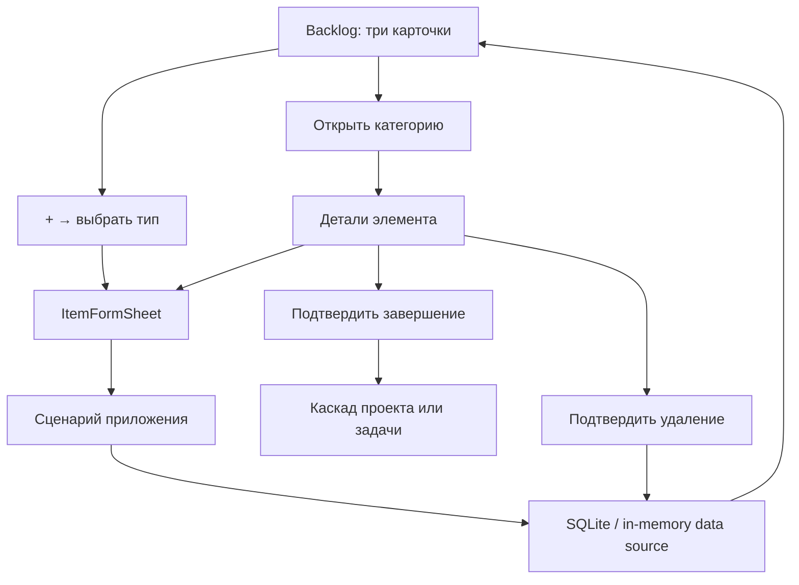

# Epic 02 — дизайн Backlog и управления делами

**Статус:** согласовано для документирования 2 августа 2026 года. Реализация начинается только после просмотра этого документа.

## Цель и границы

Epic 02 превращает вкладку `Backlog` из демонстрационного списка в место для фиксации и организации незапланированных дел. Пользователь сможет создавать и редактировать проекты, задачи, подзадачи и напоминания, перемещать задачу между проектом и категорией «Без проекта», вручную завершать элементы и удалять их после явного подтверждения.

В Epic 02 не реализуются выбор даты и времени, временные блоки, периоды, повторения, расчёт загрузки и конфликты времени. Это работа Epic 03. В деталях задачи остаётся визуальная точка входа «Запланировать» с понятным сообщением о том, что выбор времени станет доступен в Epic 03; она не записывает данные и не создаёт фиктивное расписание.

Нет поиска, фильтров, импорта, вложений, синхронизации и сетевых запросов.

## Навигация и интерфейс

Сохраняется утверждённый дизайн: нижнее меню из четырёх вкладок, iOS-стиль, иерархические переходы со стандартной кнопкой «Назад», создание и редактирование в modal sheet, опасные действия — в системном confirmation dialog.

### Корневой экран Backlog

Корень вкладки показывает ровно три интерактивные карточки, в таком порядке:

1. **Напоминания** — только незавершённые напоминания без даты. Карточка показывает количество и до двух названий.
2. **Без проекта** — незавершённые задачи без проекта вместе с их подзадачами. Карточка показывает количество задач и до двух названий задач.
3. **Проекты** — незавершённые проекты с задачами и подзадачами. Карточка показывает количество проектов и до двух названий проектов.

На корне нет поля поиска, фильтров или фиктивных категорий. Кнопка `+` открывает sheet выбора: «Новый проект», «Новая задача», «Новое напоминание».

### Внутренние экраны и детали

- Карточка «Напоминания» открывает список напоминаний. Строка показывает название и оценочную длительность, если она есть.
- «Без проекта» открывает дерево задач верхнего уровня и их подзадач. У подзадачи отсутствуют команды создания дочернего элемента.
- «Проекты» открывает список проектов, затем дерево конкретного проекта: проект → задачи → подзадачи.
- Нажатие на проект, задачу, подзадачу или напоминание открывает экран деталей. На нём видны только понятные пользовательские действия: «Редактировать», «Завершить», «Удалить» и, для задачи или подзадачи, «Запланировать».
- «Запланировать» не назначает дату или время в Epic 02; действие сообщает границу следующего эпика. Другие действия на деталях полностью рабочие.

### Формы

Единый `ItemFormSheet` принимает режим создания или редактирования и тип сущности.

- **Проект:** обязательное непустое название, необязательное описание.
- **Задача:** обязательное непустое название; необязательные описание, проект и оценочная длительность; выбор «Без проекта» снимает связь с проектом. В форме задачи доступен список её подзадач и действие добавить подзадачу.
- **Подзадача:** обязательное непустое название; необязательные описание и оценочная длительность. Проект наследуется от родительской задачи и не редактируется отдельно.
- **Напоминание:** обязательное непустое название; необязательные дата, период, повторение и оценочная длительность сохраняются как данные без формирования расписания до Epic 03.

Пустое или состоящее только из пробелов название показывает текст валидации рядом с полем и не сохраняется. Для незапланированной задачи дата и время не требуются и не выводятся как обязательные поля.

## Модель и хранение

### Расширение доменной модели

Существующие сущности получают пользовательские поля, необходимые Backlog:

- `Project`: `description: string | null`, `completedAt: string | null`.
- `TaskItem` обоих видов: `description: string | null`, `estimatedDurationMinutes: number | null`, `completedAt: string | null`.
- `Reminder`: `remindsOn: string | null`, `periodStartOn: string | null`, `periodEndOn: string | null`, `repeatFrequency: 'daily' | 'weekly' | 'monthly' | null`, `repeatInterval: number | null`, `estimatedDurationMinutes: number | null`, `completedAt: string | null`.

Пустое описание хранится как `null`; длительность — положительное целое число минут либо `null`; `repeatInterval` — положительное целое число только при заполненном `repeatFrequency`, иначе `null`. Все даты — строки `YYYY-MM-DD`; границы периода задаются только парой, где начало не позже конца. Правило повторения хранится в нейтральном доменном виде, без расчёта экземпляров. Оно будет использовано Epic 03. Новые поля статуса не выводятся пользователю как технические значения: UI показывает доступные действия и понятную подпись «Завершено» только там, где это нужно для результата действия.

Для текущего и будущего архива источник истины статуса — `completedAt` в соответствующей сущности. Устаревшая таблица `completed_items`, появившаяся в Epic 01 как техническая заготовка, не используется для новых операций Epic 02; она остаётся совместимой с уже созданной SQLite-базой.

### Репозитории и сценарии

`AppDataSource` и нативная SQLite-реализация получают операции списков, обновления и удаления. Экран не обращается к SQLite напрямую: он вызывает сценарии приложения, а после успешного сценария перезагружает подготовленное представление Backlog.

Нужны следующие границы сценариев:

- создание и редактирование проекта, задачи, подзадачи и напоминания;
- построение трёх детерминированных групп Backlog;
- перенос задачи в проект или в «Без проекта»;
- завершение задачи вместе с прямыми подзадачами;
- завершение проекта вместе со всеми его задачами и подзадачами;
- завершение подзадачи или напоминания только самого элемента;
- удаление после отдельного подтверждённого намерения пользователя.

Каждый каскад завершения выполняется в одной транзакции SQLite. Повторное завершение уже завершённого элемента сохраняет исходную дату завершения. Завершение проекта **обязательно** завершает все его задачи и подзадачи; завершение задачи **обязательно** завершает её подзадачи. Напоминания не принадлежат проектам и в этот каскад не входят.

При удалении проекта задачи не уничтожаются: они становятся задачами «Без проекта», а их подзадачи сохраняются. Удаление задачи удаляет только её прямые подзадачи как связанные элементы; confirmation dialog заранее сообщает их количество. Удаление подзадачи или напоминания затрагивает только выбранный элемент. Никакое удаление не меняет несвязанные сущности.

### Миграция и порядок

Добавляется следующая версионная миграция Expo SQLite. Она расширяет таблицы `projects`, `task_items` и `reminders` без удаления существующих строк. Для новых и старых строк значения по умолчанию безопасны: `null` для необязательных полей и `null` для `completed_at`.

Сортировка не зависит от порядка чтения SQLite:

- категории всегда выводятся в порядке «Напоминания» → «Без проекта» → «Проекты»;
- проекты сортируются по русской локали по названию, затем по `createdAt`, затем по `id`;
- задачи и подзадачи сортируются по `createdAt`, затем по `id`;
- напоминания сортируются по `createdAt`, затем по `id`.

Web использует тот же интерфейс `AppDataSource`, но in-memory реализацию. После обновления страницы web-данные исчезают — это допустимо для браузерного прототипа.

## Поток действий

После сохранения sheet закрывается и пользователь возвращается к обновлённому списку или деталям. После завершения либо удаления элемент исчезает из незавершённого Backlog; UI сообщает результат. При ошибке сохранения sheet остаётся открытым, введённые поля не стираются и показывается человеческое сообщение об ошибке.

## Проверка

Автоматические тесты покрывают:

1. валидацию обязательного названия и допустимой длительности;
2. создание всех четырёх типов с минимальным набором полей;
3. порядок трёх категорий и отсутствие завершённых или запланированных элементов;
4. перенос задачи в проект и обратно без потери названия, описания, длительности и подзадач;
5. запрет вложения в подзадачу;
6. каскад «задача → подзадачи» и «проект → задачи → подзадачи»;
7. сохранение даты уже состоявшегося завершения;
8. безопасное удаление проекта, задачи с подзадачами, подзадачи и напоминания;
9. миграцию SQLite и одинаковое поведение in-memory реализации;
10. интерактивный Backlog UI: карточки, формы, валидация, редактирование, перенос, завершение и confirmation dialog.

Для ручной проверки браузерного прототипа `npm run web` открывает все основные сценарии на тестовых данных. В браузере пользователь может создать и организовать тестовые элементы; постоянство данных web-версии не требуется. На iPhone постоянство проверяется через Expo SQLite.

## Критерии готовности Epic 02

- Выполнены все требования и критерии приёмки из `docs/tz/epic-02-backlog-and-task-management.md` с согласованным каскадным завершением.
- Все новые тесты написаны до производственного кода и зафиксировано их ожидаемое падение.
- Прошли `npm test`, `npm run typecheck`, `npm run lint` и экспорт браузерной версии.
- `npm run web` позволяет пройти создание, организацию, редактирование, завершение и подтверждённое удаление без iPhone.
- Нет сетевых запросов, авторизации, поиска, фильтров и реализации планирования времени.
